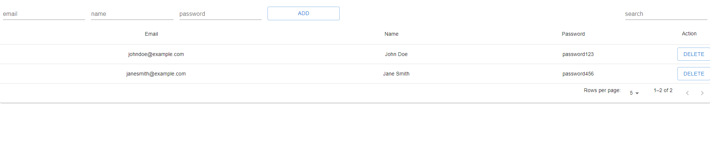

# Getting Started with Simple App

This project was built by React and NodeJS.

## Frontend Run

In the project directory, you can run:

### `npm install`

You have to install node modules.

### `npm start`

Runs the app in the development mode.\
Open [http://localhost:3000](http://localhost:3000) to view it in your browser.

The page will reload when you make changes.\
You may also see any lint errors in the console.

### `npm run build`

Builds the app for production to the `build` folder.\
It correctly bundles React in production mode and optimizes the build for the best performance.

The build is minified and the filenames include the hashes.\
Your app is ready to be deployed!

See the section about [deployment](https://facebook.github.io/create-react-app/docs/deployment) for more information.

## Backend Run
In server directory, run the command

### `npm install`

You have to install node modules.

### `database setting`

In server/config directory, If you open the database.json file, you can see.

### `database install`
First, You have to create new database.

### `tables import`
You have to run below query in mysql database.

CREATE TABLE tst_Users (
id INT NOT NULL AUTO_INCREMENT,
name VARCHAR(50) NOT NULL,
email VARCHAR(100) NOT NULL,
password VARCHAR(255) NOT NULL,
PRIMARY KEY (id)
);
INSERT INTO tst_Users (name, email, password) VALUES
('John Doe', 'johndoe@example.com', 'password123'),
('Jane Smith', 'janesmith@example.com', 'password456'),
('Bob Johnson', 'bobjohnson@example.com', 'password789');
CREATE TABLE tst_DataList (
id INT NOT NULL AUTO_INCREMENT,
name VARCHAR(50) NOT NULL,
description TEXT,
PRIMARY KEY (id)
);
INSERT INTO tst_DataList (name, description) VALUES
('Item 1', 'This is the first item in the list.'),
('Item 2', 'This is the second item in the list.'),
('Item 3', 'This is the third item in the list.');
CREATE TABLE tst_AuditLog (
id INT NOT NULL AUTO_INCREMENT,
data_id INT NOT NULL,

action VARCHAR(50) NOT NULL,
timestamp TIMESTAMP NOT NULL DEFAULT CURRENT_TIMESTAMP,
PRIMARY KEY (id)
);
INSERT INTO tst_AuditLog (data_id, action, timestamp)
VALUES (1, 'Item with ID 4 removed', NOW());

</img>

### `npm start`
Run the backend port 8080.

## `Components`
User : http://localhost:3000/
Item : http://localhost:3000/items

</img>
</img>